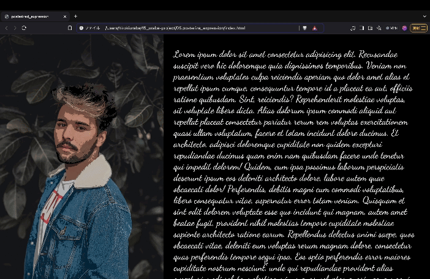

# posterize_expression💫

Photoshopでポスタライズされた写真と元の写真、スクロールすることで切り替わるプログラムです。 
ポスタライズ表現とは画像階調数(ビット数)を落とすことでイラスト調、アートのような仕上がりになる技法の一つです。 
ポスタライズ写真→元の写真と徐々に切り替えることで、2D→3Dに見えるようになるというロジックです。 

インストール後http://127.0.0.1:3000/index.htmlで表示できます。 